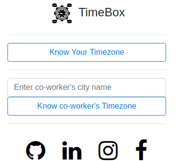
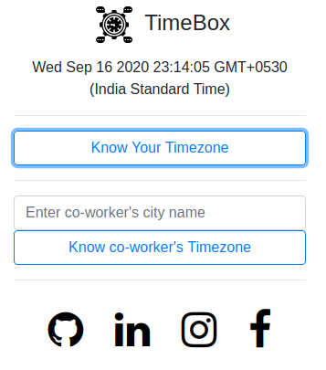
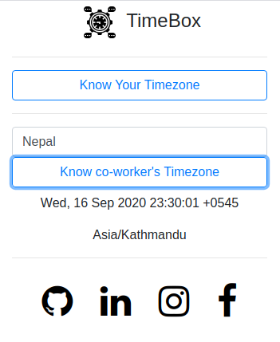

<!---  LOGO   -->

  

  
  

  
  <!---  SHIELDS   -->
  

    
  

  
  🔥 **TimeBox**  is a Chrome/Firefox extension aimed at helping remote teams by making it easier to see from where and when their co-worker's do their work during   COVID-19 pandemic. 🔥
  
  

  
  ## Features

- ⚒️ **Simple**: Bootstrapped for fast and reliable

- 📊 **Real-time**: Real time data obtained from the leading API resource 

- 📱 **Responsive**: Made responsive for Chrome & Firefox 

- 🔥 **Live**: Deployed soon

<!---  SCREENSHOOT   -->

     
     
    

## Installation and usage
Fork or download this repo, move inside and run

## Issues
- [x] No longer under active development
- [ ] Not sensitive to daylight savings time
